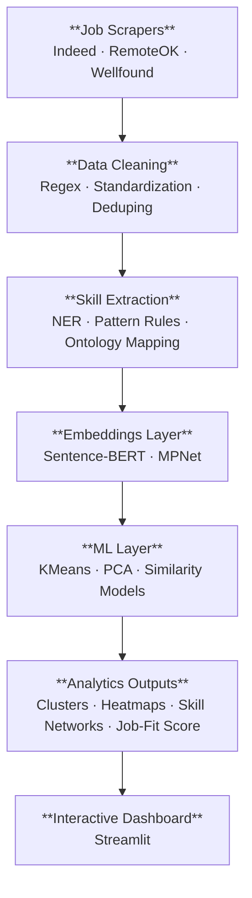

# SkillScope  
SkillScope is an end to end intelligence system that ingests real job postings, extracts skills using NLP, builds semantic embeddings, discovers latent skill clusters, and generates interactive insights for career and hiring intelligence.
The goal is to move beyond keyword counting and instead model how industries semantically express technical expectations supporting skill gap analysis, hiring trends, and personalized job fit scoring.

### Mapping the Skills That Power Modern Data Roles  

**Author:** Aash Shah   
**Email:** aashshah.04@gmail.com  
**GitHub:** [aashshahh](https://github.com/aashshahh)  
**LinkedIn:** [linkedin.com/in/aash-shah-ba002224b](https://linkedin.com/in/aash-shah-ba002224b)  


## Project Purpose  

Hiring signals evolve quickly, and traditional skill lists rarely keep up. SkillScope analyzes live job postings to uncover:
- What technical skills matter most for Data Scientist, ML Engineer, Data Analyst, and MLOps roles
- How industries differ in the skills they prioritize
- Which skill clusters naturally emerge in modern job descriptions
- How user skills compare to real-world expectations
This system mirrors how real analytics teams operate: scrape → clean → extract → embed → cluster → analyze → visualize.


## Overview  

SkillScope is an end to end data analysis pipeline that starts with raw job postings and ends with clear insight into the tools, frameworks, and languages companies are asking for today.
The workflow mirrors how real analytics teams operate: acquire data, clean it, extract meaningful signals, and present insights that support decision making. 


## Motivation  

Technology evolves fast. Course syllabi and generic skill lists usually lag behind what employers expect right now.
SkillScope addresses that gap by grounding its insights in freshly scraped job data. The goal is simple: help learners, educators, and early-career professionals invest their time in the skills that are actually showing up in current job descriptions.

## System Architecture



## Reasearch Questions 

### RQ1 — How do industries differ in their semantic skill signals?
Job postings carry implicit meaning beyond keywords. Embeddings reveal deeper industry-specific patterns:
finance → SQL, Airflow, risk modeling
tech → PyTorch, transformers
analytics → dashboards, experimentation frameworks
These patterns highlight real shifts in technical expectations across sectors.

### RQ2 — How do skills co-occur and form latent clusters?
Using SBERT + KMeans, SkillScope surfaces hidden groupings such as:
• core ML competencies
• data engineering pipelines
• cloud ecosystems
• applied modeling + analytics
This creates a semantic skill graph instead of a flat keyword dictionary.
### RQ3 — Can we predict job-fit using embedding similarity?
By averaging embeddings from job descriptions and comparing them with user skill embeddings, we compute cosine-similarity-based job-fit scores.
This becomes the foundation for a personalized, intelligent resume recommender.
### RQ4 — How does required skill complexity scale with experience?
Early signals show a clear progression:
junior → tool-centric (SQL, Excel, scikit-learn)
mid-level → systems (Spark, Airflow, AWS)
senior → architecture, leadership, strategic modeling
SkillScope aims to quantify this trajectory at scale.

## Data Pipeline  

| Stage | Description | Key Tools |
|--------|--------------|-----------|
| **1. Collection** | Scraped live postings using RemoteOK’s public API and Playwright automation. | Python, Requests, Playwright |
| **2. Cleaning** | Removed duplicates, standardized fields, normalized skill tags. | Pandas, NumPy |
| **3. Skill Extraction** | Tokenized and filtered tags to isolate individual technical skills. | NLTK, regex |
| **4. Analysis & Visualization** | Counted skill frequencies and plotted demand trends. | Matplotlib, Plotly |
| **5. Dashboard (Planned)** | Interactive web interface for exploring skill demand by category and region. | Streamlit |


## Repository Structure  
```
skillscope/
│
├── src/
│   ├── ingest/          # scrapers, API clients
│   ├── clean/           # cleaning + normalization
│   ├── nlp/             # tokenization, extraction, embeddings
│   ├── models/          # clustering, similarity, scoring
│   ├── utils/           # logging, configuration helpers
│   └── dashboard/       # Streamlit UI
│
├── data/
│   ├── raw/             # original scraped job postings
│   ├── interim/         # cleaned intermediate datasets
│   └── processed/       # embeddings, clusters, skill ontology
│
├── config/
│   ├── settings.yaml    # scraping + NLP configs
│   └── skills.json      # curated skill ontology
│
├── notebooks/           # EDA + exploratory pipelines
├── report/              # final project report/slides
├── visuals/             # diagrams, charts
│
├── requirements.txt
├── .gitignore
└── README.md
```

## Tech Stack 

### Language
Python 3.11+

### Scraping
BeautifulSoup
Playwright
Requests

### NLP
spaCy
NLTK
HuggingFace Transformers
Sentence-BERT

### Machine Learning
scikit-learn (KMeans, PCA, Agglomerative, similarity models)

### Visualization
Streamlit
Plotly

### Storage
CSV / Parquet

### Configuration
YAML
JSON


## Setup  
Clone the repository and install dependencies:
git clone https://github.com/aashshahh/skillscope.git
cd skillscope
pip install -r requirements.txt
Run the scraper:
python data_collection/test_playwright.py
Open the analysis notebooks:
jupyter notebook notebooks/


