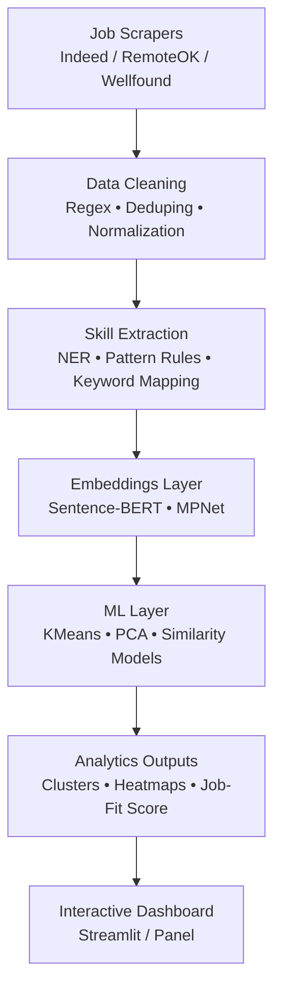

# SkillScope: A Semantic Skill Intelligence Engine for Data Roles

SkillScope is an end-to-end system that ingests real job postings, extracts skills using NLP, builds semantic embeddings, discovers latent skill clusters, and generates interactive visualizations for career intelligence.  
The goal is to move beyond keyword extraction and build a semantic representation of industry expectations—supporting skill-gap analysis, role comparison, and personalized job-fit scoring.

---

## 1. System Architecture

### High-Level Workflow

---

## 2. Project Folder Structure 

skillscope/
│
├── src/
│   ├── ingest/          # scrapers, API clients
│   ├── clean/           # cleaning and normalization
│   ├── nlp/             # tokenization, extraction, embeddings
│   ├── models/          # clustering, similarity, scoring
│   ├── utils/           # logging, config loader
│   └── dashboard/       # Streamlit/Panels dashboard
│
├── data/
│   ├── raw/             # raw scraped job postings
│   ├── interim/         # cleaned text
│   └── processed/       # embeddings, clusters, skill ontology
│
├── config/
│   ├── settings.yaml    # scraping params, NLP config, model settings
│   └── skills.json      # skill ontology
│
├── notebooks/           # EDA + exploratory NLP
├── report/              # final PDF/report
├── visuals/             # architecture diagrams, charts
│
└── README.md

## 3. Reasearch Questions 

###RQ1 — How do industries differ in their semantic skill signals?
Job postings carry implicit meaning beyond keywords. Embeddings reveal deeper industry-specific patterns:
finance → SQL, Airflow, risk modeling
tech → PyTorch, transformers
analytics → dashboards, experimentation frameworks
These patterns highlight real shifts in technical expectations across sectors.

### RQ2 — How do skills co-occur and form latent clusters?
Using SBERT + KMeans, SkillScope surfaces hidden groupings such as:
• core ML competencies
• data engineering pipelines
• cloud ecosystems
• applied modeling + analytics
This creates a semantic skill graph instead of a flat keyword dictionary.
### RQ3 — Can we predict job-fit using embedding similarity?
By averaging embeddings from job descriptions and comparing them with user skill embeddings, we compute cosine-similarity-based job-fit scores.
This becomes the foundation for a personalized, intelligent resume recommender.
### RQ4 — How does required skill complexity scale with experience?
Early signals show a clear progression:
junior → tool-centric (SQL, Excel, scikit-learn)
mid-level → systems (Spark, Airflow, AWS)
senior → architecture, leadership, strategic modeling
SkillScope aims to quantify this trajectory at scale.

## 4. Tech Stack 

### Language
Python 3.11+

### Scraping
BeautifulSoup
Playwright
Requests

### NLP
spaCy
NLTK
HuggingFace Transformers
Sentence-BERT

### Machine Learning
scikit-learn (KMeans, PCA, Agglomerative, similarity models)

### Visualization
Streamlit
Plotly

### Storage
CSV / Parquet

### Configuration
YAML
JSON
